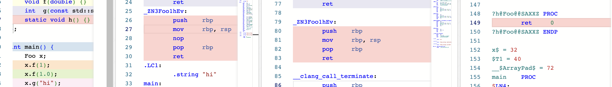

# Libraries, Frameworks and APIs

## Exploring C++ Name Mangling & ABI Differences

This experiment shows how **GCC/Clang (Itanium ABI)** and **MSVC (Microsoft ABI)** encode the same C++ function names differently.

### Reproduce locally (macOS)

```bash
# Apple Clang (libc++)
clang++ -std=c++20 -O0 -c overload.cpp -o clang.o
llvm-nm clang.o                 # mangled
llvm-nm --demangle clang.o      # demangled (or: nm -C clang.o)

# Optional: Homebrew GCC (libstdc++)
# brew install gcc
g++-14 -std=c++20 -O0 -c overload.cpp -o gcc.o   # adjust version if needed
nm gcc.o
nm -C gcc.o
```

> Tip: On macOS, prefer `llvm-nm` or `nm -C` for demangling. `c++filt` also works.

---

### Reproduce in Compiler Explorer (Godbolt)

* Add three compilers: **GCC x86-64**, **Clang x86-64**, **MSVC/clang-cl x64**.
* Flags:

  * GCC/Clang: `-std=c++20 -O0 -fno-inline -fno-omit-frame-pointer`
  * MSVC: `/std:c++20 /Od`
* Turn **off “Demangle identifiers”** in the assembly view to see raw mangled names.

---

### Observed mangled names

| Function                                  | GCC / Clang (Itanium ABI)                                                                                                                                                                     | MSVC (Microsoft ABI)                                                               |
| ----------------------------------------- | --------------------------------------------------------------------------------------------------------------------------------------------------------------------------------------------- | ---------------------------------------------------------------------------------- |
| `Foo::f(int)`                             | `_ZN3Foo1fEi`                                                                                                                                                                                 | `?f@Foo@@QEAAXH@Z`                                                                 |
| `Foo::f(double)`                          | `_ZN3Foo1fEd`                                                                                                                                                                                 | `?f@Foo@@QEAAXN@Z`                                                                 |
| `Foo::g(std::string const&) const -> int` | **GCC (libstdc++)**: `_ZNK3Foo1gERKNSt7__cxx1112basic_stringIcSt11char_traitsIcESaIcEEE`  **Clang (libc++)**: `_ZNK3Foo1gERKNSt3__112basic_stringIcNS0_11char_traitsIcEENS0_9allocatorIcEEEE` | `?g@Foo@@QEBAHAEBV?$basic_string@DU?$char_traits@D@std@@V?$allocator@D@2@@std@@@Z` |
| `Foo::h()` (static)                       | `_ZN3Foo1hEv`                                                                                                                                                                                 | `?h@Foo@@SAXXZ`                                                                    |

**Notes**

* **Itanium ABI (GCC/Clang)** encodes scopes and types compactly:

  * `_Z` prefix signals a mangled symbol.
  * `N ... E` means *nested name*; `3Foo` (length+“Foo”), `1f` (“f”).
  * Parameter codes: `i` = `int`, `d` = `double`.
  * `K` before the class name indicates a `const`-qualified member function (seen on `g`).
  * `std::string` differs by standard library: `__cxx11` (libstdc++) vs `__1` (libc++).
* **Microsoft ABI (MSVC/clang-cl)** decorates as `?name@Class@@...`:

  * `QEAAXH@Z` ≈ this-pointer + `void` return + `int` parameter.
  * `N` encodes `double`.
  * `SAXXZ` indicates `static void()`.

---

### Sample symbol tables from this repo’s runs

**Apple Clang (libc++) object (`clang.o`):**

```
__ZN3Foo1fEi
__ZN3Foo1fEd
__ZN3Foo1hEv
__ZNK3Foo1gERKNSt3__112basic_stringIcNS0_11char_traitsIcEENS0_9allocatorIcEEEE
```

**GCC 13.4 on Godbolt (libstdc++):**

```
_ZN3Foo1fEi
_ZN3Foo1fEd
_ZNK3Foo1gERKNSt7__cxx1112basic_stringIcSt11char_traitsIcESaIcEEE
_ZN3Foo1hEv
```

**MSVC x64 on Godbolt:**

```
?f@Foo@@QEAAXH@Z
?f@Foo@@QEAAXN@Z
?g@Foo@@QEBAHAEBV?$basic_string@DU?$char_traits@D@std@@V?$allocator@D@2@@std@@@Z
?h@Foo@@SAXXZ
```

---

### Takeaways

* **Same C++** produces **different mangled names** depending on platform ABI and standard library.
* GCC and Clang generally align on **Itanium C++ ABI**; differences you see in `std::string` come from **libstdc++ vs libc++** inline namespaces.
* MSVC uses the **Microsoft ABI**, with visibly different decoration for class scope, calling convention, qualifiers, and parameter types.

---

### Comparison - Mangled Names

```

```
